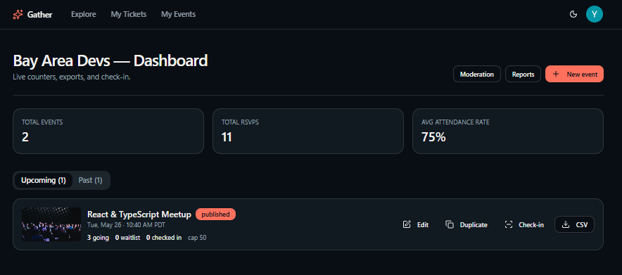
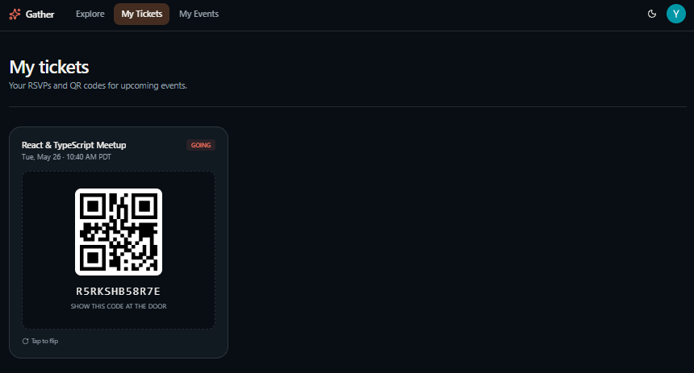
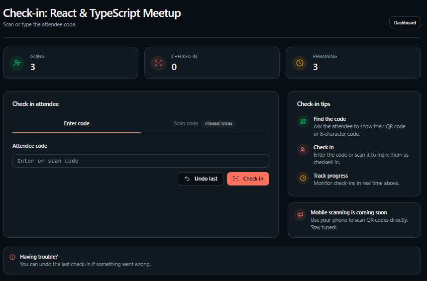

# Gather

A free, open community events platform. Hosts publish events. Attendees RSVP, get tickets, check in, and leave feedback. Built on TanStack Start + Lovable Cloud.

## Quick start

```bash
bun install
bun run dev          # http://localhost:5173
```

Environment variables (auto-injected by Lovable Cloud):
- `VITE_SUPABASE_URL`, `VITE_SUPABASE_PUBLISHABLE_KEY` — browser
- `SUPABASE_URL`, `SUPABASE_PUBLISHABLE_KEY`, `SUPABASE_SERVICE_ROLE_KEY` — server

## Hosting your first event

1. **Sign up** at `/sign-in` (email + password or Google).
2. **Become a host** — go to `/become-a-host`, pick a name + slug.
3. **Create an event** from the host dashboard (`/h/your-slug/dashboard`). Title, date/time + timezone, venue or online URL, capacity, cover image.
4. **Publish.** Drafts are members-only; published events get a public page at `/e/your-event-slug`.
5. **Share the link.** OG image, title and description render in iMessage, Slack, Twitter/X.



## RSVPing & tickets

1. Open any event page (`/e/:slug`). Click **RSVP**.
2. If signed out, you bounce to `/sign-in` and back.
3. RSVP confirms instantly. If the event is at capacity, you join the **waitlist** — promotion is automatic when someone cancels.
4. **Ticket** with QR code is at `/tickets`. Click **Add to Calendar** to download an `.ics` file.
5. **Cancel** any time from the ticket page.



## Running check-in

1. Open the host dashboard → pick the event → **Check-in**.
2. Enter the attendee's 12-character code (visible on their ticket). Green = success, yellow = already checked in, red = invalid/cancelled.
3. **Undo** removes a check-in if you scan the wrong person.
4. Both `host` and `checker` roles can run check-in.



## Post-event tools

- **Export CSV** — attendance with name, email, RSVP status and check-in time. Opens cleanly in Excel and Google Sheets (UTF-8 BOM, RFC 4180 quoting).
- **Moderate gallery** — `/h/:slug/moderation` approves or rejects user-uploaded photos.
- **Review feedback** — past events surface 1–5 star ratings + comments on the event page.
- **Reports queue** — `/h/:slug/reports` shows user-flagged events and photos. Hide or dismiss in one click.

## Tech notes

- **Routing:** TanStack Router file-based routes in `src/routes/`.
- **Server logic:** `createServerFn` in `src/server/*.functions.ts`.
- **Backend:** Lovable Cloud (Supabase). RLS on every table.
- **Atomic waitlist:** `create_rsvp` and `cancel_rsvp` are PL/pgSQL functions with row-level locks.
- **Rate limiting:** RSVP 10/min, reports 5/min (in-memory token bucket).
